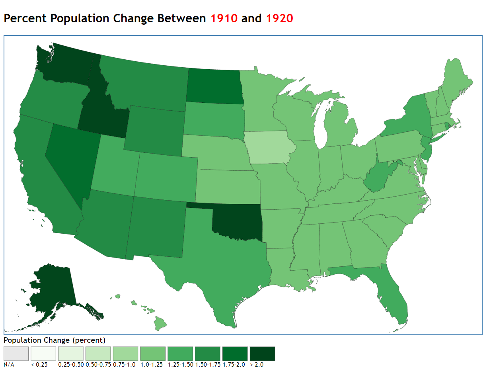

# d3-map-change-demo
Demo of mapping change over time using d3.js: change in population density, by state, for each decade between 1790 and 2010.

This demo requires the following external libraries:
  1. d3.js version 6.3.1, loaded from a CDN
  2. jquery version 1.11.1, loaded from a CDN
  3. colorbrewer.js, loaded from colorbrewer2.org

This demo was presented at April 3, 2015 CommGIS meeting and at MassIT on April 24, 2015.
At that time, the demo used D3 version 3.5.17. It was migrated to D3 version 6.3.1 on January 7, 2021.  

The careful viewer will notice some \(at least somewhat\) surprising things,
for example: Vermont was enumerated by the census before it was admitted to the union!



## Internals
This demo illustrates how to cause the symbology for a D3 map to change (i.e., transition)
in reponse to a timer event. In this case, the map's symbology is transitioned to display
the change in a state's population density from one decade to the next from 1790 through
2010 every 5000 millisecnonds, i.e., every 5 seconds.

Execution is 'kicked-off' by this piece of code in the index.html file:
```
		$(document).ready(function() {
			run_demo();	
		});	
```
Here, we use the jQuery library to notify us when the document's __ready__ event has fired.
This event is fired by the browser when  the HTML document has been completely parsed; 
it doesn't wait for other things like images, subframes, and async scripts to finish loading.
See this [MDN page](https://developer.mozilla.org/en-US/docs/Web/API/Window/DOMContentLoaded_event) for full details.
When this event fires, the code snippet listed above calls our __run\_demo__ function.

The __run\_demo__  function loads a GeoJSON file containing geographic data for the US states,
and a CSV file containing information on the year each state was admitted to the union, its
population in each decennial census between 1790 and 2010, and the population change for 
each decade with respect to the previous decade.
```
	d3.json("../data/us_states_5m.geo.json")
		.then(function(geoJson) {
			d3.csv("../data/us_pop.csv")
				.then(function(pop_csv) {
					generateMap(geoJson, pop_csv);
			});
		});
```
It uses d3's __d3.json__ and __d3.csv__ to load these two data sources, respectively.
When both data sources have been loaded successfully, it calls the __generateViz__ function.

The __generateViz_ function is organized as follows:
1. Some 'sanity check' code to verify that the number of features in the geographic data is
   the same as the number of records in the CSV population data
2. Code to create the SVG container for the map visualization, the map's projection,
   and an SVG geoPath generator function for that projection
3. The domain and range for a scale to display per-decade population change data;
   we use the a 9-step Green color scale from the [colorbrewer](https://colorbrewer2.org/) library
4. Code to create a 'blank' (white fill color) map of the US states
5. Code to set the event timer interval to 5000 milliseconds, and to set the event
   handler for timer events to the __setSymbology__ function
6. The __setSymbology__ function - see below
7. The __setLegend__ function, which generates a legend for the map for each decade

The __setSymbology__ function does the following:
1. Determines the 'current' decade being processed
2. Determines the name of the attribute in the population data table with the 
   population change for this decade with respect to the previous decade
3. For each SVG \<path\> in the visualization (i.e., each state):
  1. Initiates a D3 transition of 2500 millisecond's duration
  2. Were the fill color is set by calling the __popChgScale__ color scale
     defined in step \(3\) above on the population change for the
	 state for the 'current' decade

